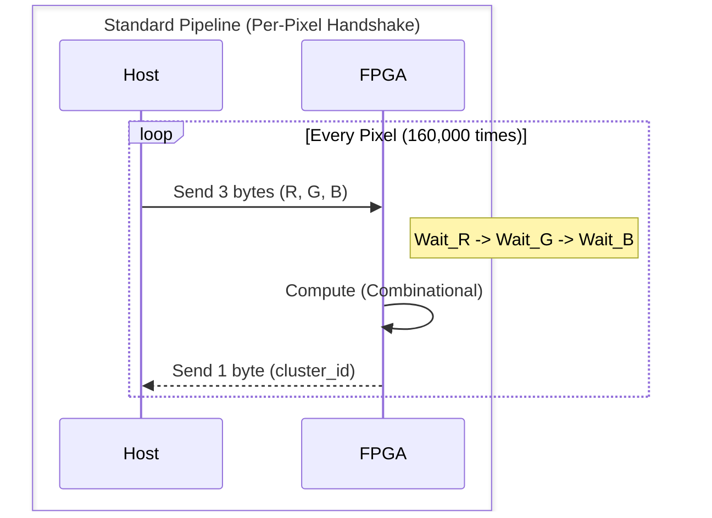
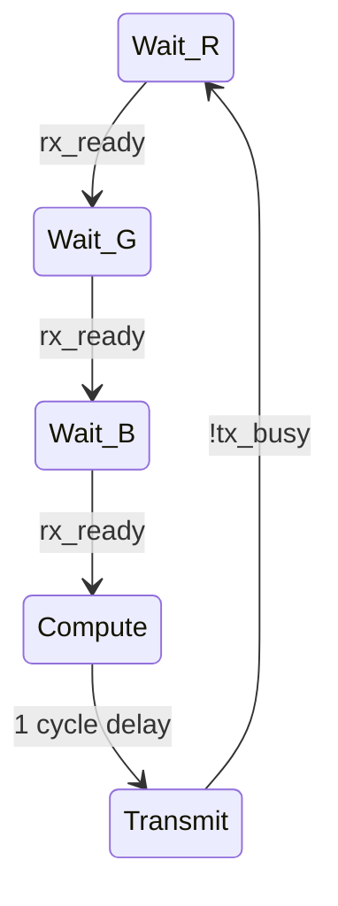
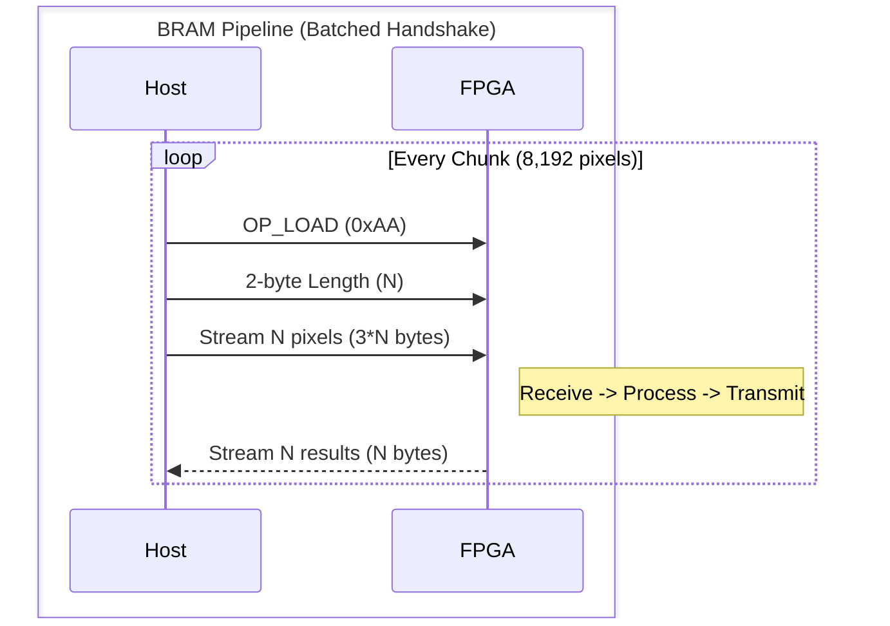
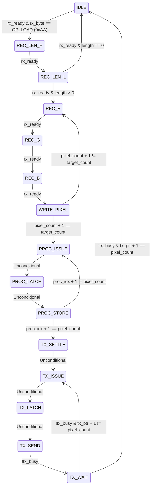

# FPGA K-Means Accelerator

> **Performance Summary:**
> | Metric | Standard Pipeline | BRAM-Batched Pipeline | Improvement |
> |---|---|---|---|
> | **Measured Time** | 286.73 s | 55.35 s | **5.18x Speedup** |
> | **Link Utilization** | 19.4% | 99.6% | **+80.2%** |

## 1. Standard Pipeline (Baseline)

The baseline K-Means accelerator utilizes a purely combinational distance-and-compare engine paired with a simple state machine that enforces a single-pixel handshake protocol.

**Architecture Details:**
The core compute logic is defined by three parallel instances of `distance_core` which calculate the squared Euclidean distance `(R1-R2)^2 + (G1-G2)^2 + (B1-B2)^2` between the incoming pixel and the three hardcoded centroids. These distances are fed into a `comparator_unit` which combinationally outputs a 2-bit `cluster_id` representing the minimum distance.

The top-level FSM in `inference.v` drives this engine and orchestrates the single-pixel handshake protocol with the host PC. The protocol requires the host to send 3 bytes (R, G, B) and wait for a 1-byte response (the cluster ID) before repeating the process for the next pixel. This strictly serializes communication and computation, tying the timing of every single pixel to a full round-trip delay between the host and the FPGA.

**FSM Walkthrough (`inference.v`):**

| State | Trigger/Condition | Action | Next State |
|---|---|---|---|
| `Wait_R` | `rx_ready` | Assigns `R <= rx_byte` | `Wait_G` |
| `Wait_G` | `rx_ready` | Assigns `G <= rx_byte` | `Wait_B` |
| `Wait_B` | `rx_ready` | Assigns `B <= rx_byte` | `Compute` |
| `Compute` | Unconditional (1 cycle delay) | `winning_cluster` is combinationally valid here. Packs result (`tx_byte <= {6'd0, winning_cluster}`) | `Transmit` |
| `Transmit` | `!tx_busy` | Asserts `tx_start <= 1'b1` | `Wait_R` |

*Note: As noted in the code comments (`inference.v`, line 80), "one cycle delay needed: B register updates at end of Wait_B clock edge".*

## 2. BRAM-Batched Pipeline

The BRAM-batched variant (`inference_bram_v2.v`) overhauls the communication protocol and FSM to break the serialization bottleneck. It utilizes True Dual-Port Block RAM to buffer entire chunks of the image, processing them sequentially only after they are fully received.

**Architecture Details & FSM Walkthrough (`inference_bram_v2.v`):**
The BRAM FSM introduces a decoupled multi-phase pipeline (Receive, Process, Transmit).

| State | Trigger/Condition | Action | Next State |
|---|---|---|---|
| `IDLE` | `rx_ready` & `rx_byte == OP_LOAD` | Resets write address, `pixel_count`, and `target_count` | `REC_LEN_H` |
| `REC_LEN_H` | `rx_ready` | Receives high byte of chunk length | `REC_LEN_L` |
| `REC_LEN_L` | `rx_ready` | Receives low byte. If length is 0, aborts to guard against overflow. | `REC_R` or `IDLE` |
| `REC_R` | `rx_ready` | Receives Red byte | `REC_G` |
| `REC_G` | `rx_ready` | Receives Green byte | `REC_B` |
| `REC_B` | `rx_ready` | Receives Blue byte, packs 24-bit data, sets write address | `WRITE_PIXEL` |
| `WRITE_PIXEL` | Unconditional | Asserts write enable, increments `pixel_count` | `PROC_ISSUE` or `REC_R` |
| `PROC_ISSUE` | Unconditional | Presents read address to pixel BRAM | `PROC_LATCH` |
| `PROC_LATCH` | Unconditional | Pixel data valid. Assigns `res_din` and sets result write address | `PROC_STORE` |
| `PROC_STORE` | Unconditional | Asserts result write enable. | `TX_SETTLE` or `PROC_ISSUE` |
| `TX_SETTLE` | Unconditional | 1-cycle buffer for final result commit | `TX_ISSUE` |
| `TX_ISSUE` | Unconditional | Presents read address to result BRAM | `TX_LATCH` |
| `TX_LATCH` | Unconditional | Result data valid. Assigns `tx_byte <= res_dout` | `TX_SEND` |
| `TX_SEND` | `!tx_busy` | Asserts `tx_start <= 1` | `TX_WAIT` |
| `TX_WAIT` | `!tx_busy` | Checks if entire chunk is sent | `IDLE` or `TX_ISSUE` |

**Engineering Concepts:**
*   **Batch processing via BRAM:** Buffering thousands of pixels on-chip before compute begins radically alters the timing profile. Instead of paying a full USB/UART latency penalty for every single pixel, the overhead is amortized across chunks of up to 8,192 pixels. 
*   **Decoupling the slow interconnect from the fast compute engine:** The combinational compute engine finishes processing a pixel in just 2 clock cycles. The standard pipeline forces this fast engine to sit idle, waiting on the extremely slow per-pixel UART handshake. The BRAM pipeline solves this by letting data accumulate independently of the compute timing. The slow phase (UART streaming) and the fast phase (math execution) are executed as discrete, independent batches, preventing the slow interconnect from artificially throttling the compute cores.
*   **Length-prefixed framing:** The BRAM FSM uses a length-prefixed protocol where an `OP_LOAD` header (0xAA) is followed immediately by a 2-byte pixel count. As noted in the source (`inference_bram_v2.v`, lines 17-18), this is a standard design pattern used to solve the "in-band signaling" problem. By announcing the payload length upfront, the receiver can allocate exactly enough cycles to blindly stream data without continuously inspecting the payload for delimiters. This eliminates the risk of payload data colliding with opcodes and prevents unnecessary handshake round-trips.

> **Observation:** This is a general pattern for any slow-interconnect/fast-compute system.

## 3. Why the BRAM Pipeline Is Faster — Overhead Breakdown

| Metric | Standard Pipeline | BRAM-Batched Pipeline | Theoretical Max (115,200 baud) |
|---|---|---|---|
| **Effective Throughput** | 2,232 bytes/s | ~11,560 bytes/s | 11,520 bytes/s |
| **% of Theoretical Link Cap.** | 19.4% | 99.6% | 100% |
| **Total Transfer Runtime** | 286.73 s | 55.35 s | 55.56 s |
| **Handshake Overhead Per Pixel** | ~1.445 ms | 0 ms | 0 ms |

The pre-computed timing figures provide a stark illustration of interconnect bottlenecks. Processing a 400x400 image involves transferring a total of 640,000 bytes (480,000 bytes in at 3 bytes/pixel + 160,000 bytes out at 1 byte/pixel). Over a 115,200 baud UART link (10 bits/byte, yielding a theoretical max throughput of 11,520 bytes/s), the absolute theoretical bandwidth floor for this full transfer is 55.56 seconds.

The BRAM pipeline measured an average time of 55.35 seconds (individual runs of 54.84 s and 55.85 s), landing within 0.4% of the theoretical floor. It effectively saturates the UART link.

In contrast, the standard pipeline took 286.73 seconds. This translates to an effective throughput of just 2,232 bytes/s — a mere 19.4% of the theoretical link capacity. The standard pipeline incurs a massive total overhead beyond the theoretical floor of 231.17 seconds, which constitutes 80.6% of its total runtime. This equates to approximately 1.445 ms of pure handshake overhead per pixel.

Because the compute engine is mathematically and structurally identical in both pipelines (as evidenced by the identical `MULT18X18` and `MULT9X9` counts in the resource utilization tables), the algorithm itself executes at the exact same speed. The entire 5.18x speedup achieved by the BRAM pipeline is strictly attributable to the removal of per-pixel handshake overhead. 

## 4. Comparison Tables

### Table A — Resource Utilization Comparison

| Resource | Standard | BRAM-Batched |
|---|---|---|
| VCC | 1 / 1 (100%) | 1 / 1 (100%) |
| IOB | 9 / 276 (3%) | 9 / 276 (3%) |
| LUT4 | 473 / 8640 (5%) | 752 / 8640 (8%) |
| OSER16 | 0 / 80 (0%) | 0 / 80 (0%) |
| IDES16 | 0 / 80 (0%) | 0 / 80 (0%) |
| IOLOGICI | 0 / 276 (0%) | 0 / 276 (0%) |
| IOLOGICO | 0 / 276 (0%) | 0 / 276 (0%) |
| MUX2_LUT5 | 52 / 4320 (1%) | 79 / 4320 (1%) |
| MUX2_LUT6 | 20 / 2160 (0%) | 19 / 2160 (0%) |
| MUX2_LUT7 | 7 / 1080 (0%) | 6 / 1080 (0%) |
| MUX2_LUT8 | 3 / 1080 (0%) | 2 / 1080 (0%) |
| ALU | 186 / 6480 (2%) | 240 / 6480 (3%) |
| GND | 1 / 1 (100%) | 1 / 1 (100%) |
| DFF | 80 / 6480 (1%) | 311 / 6480 (4%) |
| RAM16SDP4 | 0 / 270 (0%) | 0 / 270 (0%) |
| BSRAM | 0 / 26 (0%) | 16 / 26 (61%) |
| ALU54D | 0 / 10 (0%) | 0 / 10 (0%) |
| MULTADDALU18X18 | 0 / 10 (0%) | 0 / 10 (0%) |
| MULTALU18X18 | 0 / 10 (0%) | 0 / 10 (0%) |
| MULTALU36X18 | 0 / 10 (0%) | 0 / 10 (0%) |
| MULT36X36 | 0 / 5 (0%) | 0 / 5 (0%) |
| MULT18X18 | 3 / 20 (15%) | 3 / 20 (15%) |
| MULT9X9 | 3 / 40 (7%) | 3 / 40 (7%) |
| PADD18 | 0 / 20 (0%) | 0 / 20 (0%) |
| PADD9 | 0 / 40 (0%) | 0 / 40 (0%) |
| GSR | 1 / 1 (100%) | 1 / 1 (100%) |
| OSC | 0 / 1 (0%) | 0 / 1 (0%) |
| rPLL | 0 / 2 (0%) | 0 / 2 (0%) |
| FLASH608K | 0 / 1 (0%) | 0 / 1 (0%) |
| BUFG | 0 / 22 (0%) | 0 / 22 (0%) |
| DQCE | 0 / 24 (0%) | 0 / 24 (0%) |
| DCS | 0 / 8 (0%) | 0 / 8 (0%) |
| DHCEN | 0 / 24 (0%) | 0 / 24 (0%) |
| CLKDIV | 0 / 8 (0%) | 0 / 8 (0%) |
| CLKDIV2 | 0 / 16 (0%) | 0 / 16 (0%) |
| MIPI_IBUF | 0 / 22 (0%) | 0 / 22 (0%) |
| MIPI_OBUF | 0 / 20 (0%) | 0 / 20 (0%) |

### Table B — Protocol Parameters

| Parameter | Standard | BRAM-Batched |
|---|---|---|
| Baud rate (RTL) | 115,200 baud — `parameter CLKS_PER_BIT = 234 // 27MHz / 115200 Baud` | 115,200 baud — same UART modules (`CLKS_PER_BIT = 234`) |
| Baud rate (Python) | `BAUD_RATE = 115200` | `BAUD_RATE   = 115200` |
| Bytes/pixel in | 3 bytes (R, G, B) — `ser.write(bytes([r, g, b]))` | 3 bytes (R, G, B) — `byte_data = chunk.tobytes()` (pixel array reshaped to Nx3) |
| Bytes/pixel out | 1 byte — `response = ser.read(1)` | 1 byte — `result_bytes = ser.read(valid_pixels)` (one byte per pixel) |
| Batch size | N/A (single-pixel handshake) | `CHUNK_SIZE  = 8192` (Python host); Verilog BRAM depth: `parameter DEPTH = 8192` |
| Fmax (pre-route) | 151.63 MHz — `Info: Max frequency for clock 'rx.clk': 151.63 MHz (PASS at 12.00 MHz)` | 112.10 MHz — `Info: Max frequency for clock 'pixel_bram.clk': 112.10 MHz (PASS at 12.00 MHz)` |
| Fmax (post-route) | 96.06 MHz — `Info: Max frequency for clock 'rx.clk': 96.06 MHz (PASS at 12.00 MHz)` | 71.19 MHz — `Info: Max frequency for clock 'pixel_bram.clk': 71.19 MHz (PASS at 12.00 MHz)` |

## 5. Debugging Notes
The development of the accelerator involved iterating through several significant hardware bugs, documented below.

### Uninitialized FSM State (Standard Pipeline)
An early bug in `inference.v` (lines 4-5) involved an uninitialized `tx_state` giving a false positive in simulation but failing on the real FPGA. The fix involved explicitly ensuring no core signal goes uninitialized.

### The Opcode/Pixel Clash / "Random Timeout" Bug
The original BRAM protocol checked for an `OP_EXECUTE` command (0xBB / 187) during the receiving phase (`REC_R`). As documented in `debug.md` and `inference_bram_v2.v` (lines 3-7), if the Red channel of any pixel naturally contained the value 187, the FPGA falsely interpreted it as an opcode, stopped receiving data, and prematurely executed the chunk. This resulted in unexpected timeouts on the Python host as the FPGA sent back fewer bytes than expected. The fix was the implementation of Protocol v2/v3 — the Length-Prefixed Protocol, which explicitly ignores opcodes during the pixel payload phase.

### Read-After-Write Hazard / "Wrong Cluster" Bug
During the transition between processing and transmitting, the FSM moved directly from `PROC_STORE` (writing the last result to address N) into `TX_ISSUE` (reading the first result from address 0). Because BRAM exhibits "read-first" behavior when a read and write collide on the same clock edge, the read produced old, stale data for the very first pixel. The fix involved introducing the `TX_SETTLE` state, acting as a 1-clock-cycle buffer to ensure data successfully committed before any read occurred (`debug.md`).

### Single-Port BRAM Glitches and Latency
The initial BRAM implementations (`inference_bram.v` lines 11-15 and `debug.md`) relied on a single address port with a combinational multiplexer toggling between read and write. When FSM states changed, this multiplexer glitched and violated strict timing requirements. Furthermore, the design failed to account for the BRAM requiring a full clock cycle to read, causing structural timing failures. The resolution was rewriting the modules (`bram24bit_v2.v` and `bram8bit_v2.v`) to use explicit True Dual-Port Block RAM (`DPB`), featuring separate read and write ports, and explicitly padding the FSM states to respect read latencies.

### Unguarded `pixel_count` Buffer Overflows
In the original design, if the host sent an empty chunk, the FPGA design would hang forever because the `pixel_count` register was never explicitly cleared, leading to the FSM blindly processing uninitialized garbage data from memory. The current v2 FSM strictly clears `pixel_count` to 0 upon entering `IDLE` and has explicit checks to immediately abort if a chunk length of 0 is passed (`debug.md`).
