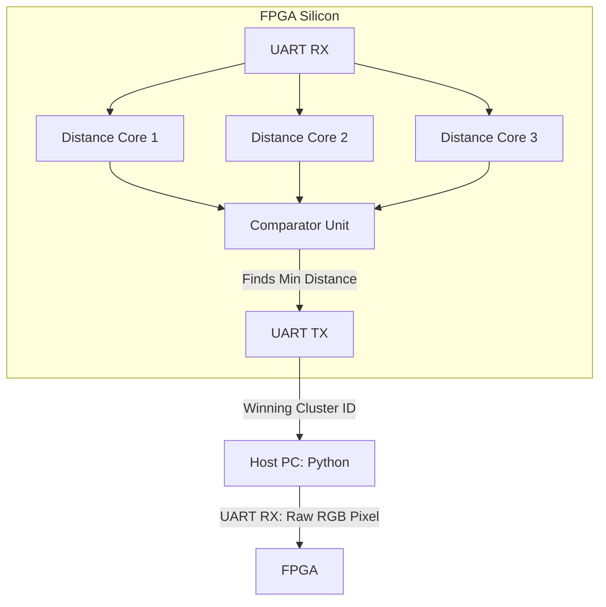

# FPGA-Based K-Means Clustering Accelerator

## Overview
This repository is an effort to implement the inference phase of the K-means clustering algorithm in hardware, exploring and exploiting the parallelism of the algorithm to accelerate computation beyond the sequential execution model of traditional CPUs. The current implementation is configured for real-time RGB image segmentation on FPGAs.
---

## Core Hardware Architecture
To achieve parallelism, the hardware computes all centroid distances concurrently. Currently for demo set 3 centroids with R,G and B.



### Module Breakdown
* **UART Transceivers:** Asynchronous serial communication with the host with parametrized baud rate.
* **Distance Cores:** Combinational logic calculating squared Euclidean distances to all centroids *simultaneously*.
* **Comparator Unit:** Evaluates parallel results and assigns the winning cluster ID.
* **Finite State Machine (FSM):** Manages data flow, memory addresses, and synchronization.

---

## Results & Demonstration

| Original Image | FPGA Segmented Output |
| :---: | :---: |
|  |  |

> **Note:** The output image is reconstructed by the Python host based entirely on the hardware-assigned cluster IDs.

---

## Two Design Approaches

1. **Standard Inference Pipeline (Stable):** A single-pixel handshake architecture. Highly accurate, but suffers from heavy OS/USB context-switching latency.
2. **High-Speed BRAM Pipeline (In Development):** Introduces Block RAM (BRAM) to batch thousands of pixels at once, eliminating software lag. *Status: Verilog verified; currently debugging physical USB-to-UART buffer overflows.*

---

## Performance & Bottlenecks

* **Hardware Speed:** Parallel distance cores process 3 clusters in just **2 clock cycles** (< 1µs at 27 MHz). The 400x400 image took about 3.5 minutes due to uart protocol.
* **Current Bottleneck:** The UART protocol limits data transfer to ~11.5 KB/s. The FPGA sits idle waiting for data.
* **Future Upgrades:** Bypassing UART via SD Card (SPI), High-Speed USB (FT232H), or migrating to PCIe/Gigabit Ethernet on larger FPGAs.

---

## Build and Flash Instructions

### Prerequisites
* **Hardware:** Gowin Tang Nano 9K (or compatible)
* **Toolchain:** Yosys, NextPNR (himbaechel), Gowin Pack, openFPGALoader
* **Software:** Python 3 (`pyserial`, `numpy`, `opencv-python`)

### Compilation Commands

**Stable Standard Architecture:**
```bash
make
make flash
python3 python_scripts/host.py
```

**Experimental BRAM Architecture:**
```bash
make TARGET=inference_bram
make flash TARGET=inference_bram
python3 python_scripts/host_bram.py
```

---

## Future Plans:
## Future Plans & Roadmap

Currently handling inference, the BRAM pipeline sets the foundation for **Hardware-Based Training**. The immediate goal is to finalize the inference pipeline, followed by expanding the system to dynamically update centroids directly on silicon.

- [ ] **Finalize BRAM Inference:** Complete the physical BRAM implementation on the FPGA and resolve the USB-to-UART buffer overflows.
- [ ] **Data Accumulation:** Accumulate RGB sums for all pixels assigned to a cluster in BRAM.
- [ ] **Hardware Division:** Implement resource-efficient division to calculate new centroid averages without exhausting the Look-Up Table (LUT) budget.
- [ ] **Autonomous Iteration:** Upgrade the FSM to loop over the dataset autonomously until centroids converge, creating a fully independent ML training accelerator.