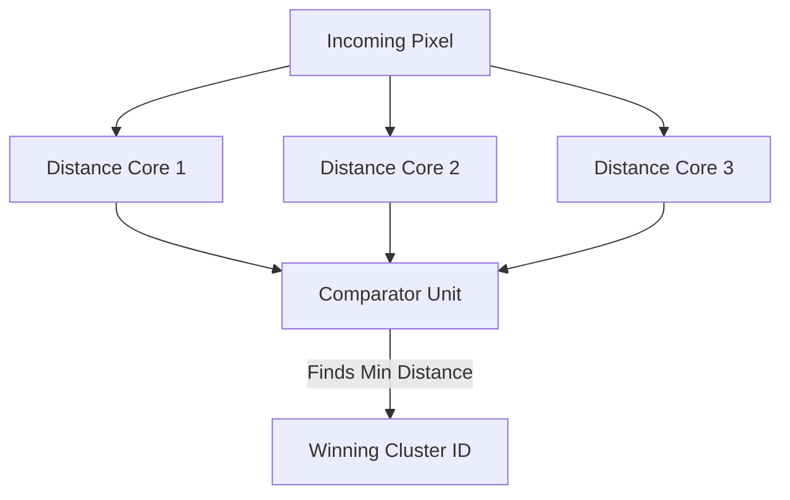

# FPGA-Based K-Means Clustering Accelerator

> A hardware accelerator for the inference phase of K-means clustering, implemented for real-time RGB image segmentation on FPGA.

**Highlights**
- Computes distances to all centroids **in parallel, in hardware** — not looped sequentially like a CPU implementation would be
- Built, synthesized, and flashed end-to-end on real Gowin Tang Nano 9K hardware using a fully open-source toolchain
- Two working communication architectures, measured and compared head-to-head: a **5.18x** speedup from redesigning the host↔FPGA protocol alone, with zero changes to the compute core
- The optimized pipeline now runs within **0.4% of the theoretical UART bandwidth ceiling** — the system is bottlenecked purely by the physical serial link, not by software, OS scheduling, or FPGA compute

---

## Table of Contents
- [Overview](#overview)
- [Core Compute Architecture](#core-compute-architecture)
- [BRAM-Batched Pipeline (Primary)](#bram-batched-pipeline-primary)
- [Standard Pipeline (Baseline)](#standard-pipeline-baseline)
- [Performance Comparison](#performance-comparison)
- [Resource Utilization](#resource-utilization)
- [Results & Demonstration](#results--demonstration)
- [Build and Flash Instructions](#build-and-flash-instructions)
- [Roadmap](#roadmap)

---

## Overview

This repository implements the inference phase of the K-means clustering algorithm directly in hardware, exploiting the algorithm's natural parallelism (every centroid distance can be computed independently and simultaneously) instead of the sequential execution model a CPU is stuck with. The current build is configured for real-time RGB image segmentation, with the FPGA receiving raw pixel data and returning cluster assignments.

The repo contains **two communication architectures** built on the exact same compute core — this was deliberate, to isolate and measure how much of the system's real-world performance was actually limited by the algorithm versus the interconnect.

---

## Core Compute Architecture

Both pipelines below share an identical compute engine. The demo configuration uses 3 centroids over the R, G, and B channels, with all three distances computed concurrently.



| Module | Function |
|---|---|
| **Distance Cores** | Combinational logic computing squared Euclidean distance to each centroid *simultaneously* |
| **Comparator Unit** | Evaluates all parallel distances and outputs the winning cluster ID |
| **FSM** | Manages data flow, memory addressing, and synchronization |

The compute core is untouched between the two pipelines below — multiplier usage (3x `MULT18X18`, 3x `MULT9X9`) is identical in both post-synthesis reports. Every performance difference between the two architectures comes entirely from how data moves in and out, not from the algorithm itself.

---

## BRAM-Batched Pipeline (Primary)

**Status: Done, verified on hardware.**

The standard pipeline (below) pays a full communication round-trip for every single pixel. This pipeline removes that by decoupling the host↔FPGA data transfer from the per-pixel compute entirely.

### How it works
- **Chunked transfer:** instead of one pixel per transaction, the host streams pixels in batches of up to 8,192 pixels (`DEPTH = 8192` in Verilog, `CHUNK_SIZE = 8192` in the Python host) directly into on-chip Block RAM.
- **Length-prefixed framing:** each chunk begins with a small header — a `0xAA` opcode followed by a 2-byte pixel count — instead of relying on a per-byte handshake to know how much data is coming. The FPGA reads the header once, then just streams the batch in.
- **Decoupled I/O and compute:** because pixels land in BRAM first, the host no longer waits for a response after every pixel. It sends a full chunk, the FPGA classifies the whole batch internally, and results are read back as one block. Communication and computation are no longer serialized against each other on a per-pixel basis.

This is a pure protocol/interconnect redesign — the distance cores and comparator are byte-for-byte the same logic as the standard pipeline.

### Measured Performance
- **400×400 image (160,000 pixels): 55.35 s** (average of two runs: 54.84 s, 55.85 s)
- **5.18x faster** than the standard pipeline on the identical image
- Effective throughput: **11,564 bytes/s**, against a theoretical UART maximum of **11,520 bytes/s** at 115,200 baud — i.e., **within 0.4% of the physical bandwidth ceiling**. The remaining bottleneck is not software overhead, it's the wire itself.

---

## Standard Pipeline (Baseline)

**Status: Stable, kept for comparison.**

A single-pixel handshake architecture — one pixel is sent (3 bytes: R, G, B), the FPGA responds with 1 byte (cluster ID), and only then is the next pixel sent. Simple and fully reliable, but every pixel pays a full OS/USB round-trip before the next one can begin.

### Measured Performance
- **400×400 image (160,000 pixels): 286.73 s**
- Effective throughput: **2,232 bytes/s** — only **19.4%** of the link's theoretical capacity
- **~80.6% of total runtime (231.17 s) is pure handshake overhead** — not transmission time, not compute time, just round-trip latency repeated 160,000 times. That works out to **~1.445 ms of dead time per pixel**, which is exactly what the BRAM pipeline above was built to eliminate.

---

## Performance Comparison

| Metric | Standard | BRAM-Batched |
|---|---|---|
| Time (400×400 image) | 286.73 s | 55.35 s (avg) |
| Speedup | 1x (baseline) | **5.18x** |
| Effective throughput | 2,232 B/s | 11,564 B/s |
| % of theoretical UART link capacity | 19.4% | ~100% |
| Bottleneck | Per-pixel handshake overhead (OS/USB round trips) | Physical UART bit rate — hard limit |

**Compute speed, for reference:** the parallel distance cores resolve all 3 clusters in **2 clock cycles** (< 1 µs at 27 MHz) — in both pipelines. The FPGA's actual classification work is essentially instantaneous; every number above is a communication-layer result, not a compute-layer one.

**Planned next step to move past the current UART ceiling:** bypass UART entirely via SD card (SPI), high-speed USB (FT232H), or PCIe/Gigabit Ethernet on a larger FPGA — see [Roadmap](#roadmap).

---

## Resource Utilization

Post-synthesis utilization on the Tang Nano 9K (GW1NR-9C):

| Resource | Standard | BRAM-Batched | Change |
|---|---|---|---|
| LUT4 | 473 / 8640 (5%) | 752 / 8640 (8%) | +59% |
| DFF (registers) | 80 / 6480 (1%) | 311 / 6480 (4%) | +289% |
| ALU | 186 / 6480 (2%) | 240 / 6480 (3%) | +29% |
| BSRAM | 0 / 26 (0%) | 16 / 26 (61%) | — |
| MULT18X18 | 3 / 20 (15%) | 3 / 20 (15%) | unchanged |
| MULT9X9 | 3 / 40 (7%) | 3 / 40 (7%) | unchanged |
| IOB | 9 / 276 (3%) | 9 / 276 (3%) | unchanged |
| Fmax (post-route) | 96.06 MHz | 71.19 MHz | −26% |

*Fmax is reported per nextpnr's timing report for each design's respective sampling clock domain (`rx.clk` / `pixel_bram.clk`) against the constraint file's current setting — still verifying this fully lines up with the 27 MHz system clock, noting here rather than glossing over it. Both values comfortably exceed the 27 MHz operating frequency regardless.*

A few things worth noting:
- **Multiplier usage is identical across both pipelines** — confirms the compute core itself is unmodified; every resource increase in the BRAM version is I/O and buffering logic, not algorithm logic.
- **BSRAM jumps from 0% to 61% (16/26 blocks)** — this is the literal hardware cost of batching. Worth tracking, since the planned on-chip training extension will also need BSRAM for centroid accumulators, and only ~10 blocks of headroom remain.
- **Fmax dropped ~26%** in the BRAM version, likely from the added buffering/control logic lengthening the critical path — still comfortably above the 27 MHz operating point, so timing closes either way.
- Full nextpnr device utilization logs (all resource categories) are preserved in the repo for reference.

---

## Results & Demonstration

| Original Image | FPGA Segmented Output |
| :---: | :---: |
|  |  |

> The output image is reconstructed by the Python host script, using cluster IDs assigned entirely by the FPGA — the segmentation decision itself happens on-chip.

---

## Build and Flash Instructions

### Prerequisites
- **Hardware:** Gowin Tang Nano 9K (or compatible)
- **Toolchain:** Yosys, NextPNR (himbaechel), Gowin Pack, openFPGALoader
- **Software:** Python 3 (`pyserial`, `numpy`, `opencv-python`)

### BRAM-Batched Pipeline (Primary)
```bash
make TARGET=inference_bram
make flash TARGET=inference_bram
python3 python_scripts/host_bram.py
```

### Standard Pipeline (Baseline)
```bash
make
make flash
python3 python_scripts/host.py
```

---

## Roadmap

- [x] Finalize the BRAM inference pipeline
- [x] Resolve the USB-to-UART buffer overflow
- [x] Measure and confirm the pipeline is bandwidth-bound (within 0.4% of the theoretical UART ceiling)
- [ ] Bypass UART via SD card (SPI), high-speed USB (FT232H), or PCIe/Gigabit Ethernet on a larger FPGA
- [ ] Accumulate per-cluster RGB sums in BRAM (data accumulation for centroid updates)
- [ ] Implement resource-efficient hardware division for centroid averaging without blowing the LUT budget
- [ ] Upgrade the FSM to iterate autonomously over the dataset until centroids converge — a self-contained ML training accelerator, entirely on-chip
