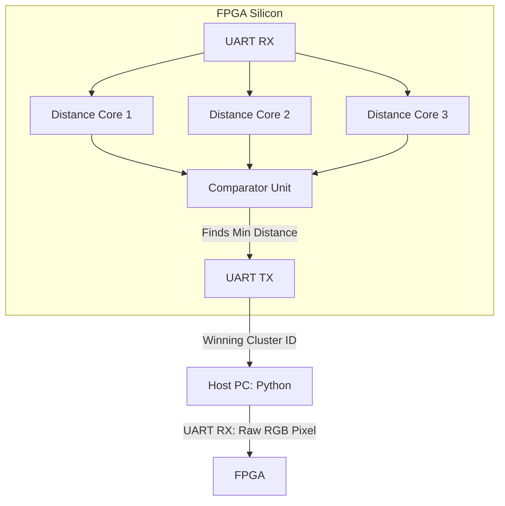

Readme · MD
# FPGA-Based K-Means Clustering Accelerator
 
> A hardware accelerator for the inference phase of K-means clustering, implemented for real-time RGB image segmentation on FPGA.
 
**Highlights**
- Computes distances to all centroids **in parallel, in hardware** — not looped sequentially like a CPU implementation would be
- Built, synthesized, and flashed end-to-end on real Gowin Tang Nano 9K hardware using a fully open-source toolchain
- Identified and quantified a real system bottleneck (UART throughput vs. compute throughput) and is actively resolving it with a BRAM-based redesign
---
 
## Table of Contents
- [Overview](#overview)
- [Core Hardware Architecture](#core-hardware-architecture)
- [Results & Demonstration](#results--demonstration)
- [Two Design Approaches](#two-design-approaches)
- [Performance & Bottlenecks](#performance--bottlenecks)
- [Resource Utilization](#resource-utilization)
- [Build and Flash Instructions](#build-and-flash-instructions)
- [Roadmap](#roadmap)
---
 
## Overview
 
This repository implements the inference phase of the K-means clustering algorithm directly in hardware, exploiting the algorithm's natural parallelism (every centroid distance can be computed independently and simultaneously) instead of the sequential execution model a CPU is stuck with. The current build is configured for real-time RGB image segmentation, with the FPGA receiving raw pixel data and returning cluster assignments.
 
---
 
## Core Hardware Architecture
 
The demo configuration uses 3 centroids over the R, G, and B channels, with all three distances computed concurrently.
 

 
### Module Breakdown
| Module | Function |
|---|---|
| **UART Transceivers** | Asynchronous serial communication with the host, parametrized baud rate |
| **Distance Cores** | Combinational logic computing squared Euclidean distance to each centroid *simultaneously* |
| **Comparator Unit** | Evaluates all parallel distances and outputs the winning cluster ID |
| **FSM** | Manages data flow, memory addressing, and synchronization between UART and the compute cores |
 
---
 
## Results & Demonstration
 
| Original Image | FPGA Segmented Output |
| :---: | :---: |
|  |  |
 
> The output image is reconstructed by the Python host script, using cluster IDs assigned entirely by the FPGA — the segmentation decision itself happens on-chip.
 
---
 
## Two Design Approaches
 
### 1. Standard Inference Pipeline — *Stable*
A single-pixel handshake architecture: one pixel is sent, processed, and acknowledged before the next is sent. Reliable and fully working, but throughput is limited by OS/USB context-switching overhead on every handshake.
 
### 2. High-Speed BRAM Pipeline — *In Development*
Introduces on-chip Block RAM to batch thousands of pixels at once, removing the per-pixel handshake and its software-side latency.
**Status:** Verilog verified in simulation; currently debugging a physical USB-to-UART buffer overflow that appears only on real hardware.
 
---
 
## Performance & Bottlenecks
 
- **Compute speed:** the parallel distance cores resolve all 3 clusters in **2 clock cycles** (< 1 µs at 27 MHz)
- **End-to-end speed:** a 400×400 image takes ~3.5 minutes, entirely due to the UART link
- **Bottleneck:** UART caps data transfer at ~11.5 KB/s — the FPGA compute finishes essentially instantly and then sits idle waiting for the next pixel
- **Planned fixes:** bypass UART via SD card (SPI), high-speed USB (FT232H), or PCIe/Gigabit Ethernet on a larger FPGA
This is the core finding of the project so far: **the algorithm was never the bottleneck — the interconnect was.** The BRAM pipeline exists specifically to remove that bottleneck.
 
---
 
## Resource Utilization
 
Post-synthesis utilization on the Tang Nano 9K (GW1NR-9C), for the **standard single-pixel handshake pipeline**:
 
| Resource | Used | Available | Utilization |
|---|---|---|---|
| LUT4 | 473 | 8640 | 5% |
| DFF (registers) | 80 | 6480 | 1% |
| ALU | 186 | 6480 | 2% |
| MULT18X18 | 3 | 20 | 15% |
| MULT9X9 | 3 | 40 | 7% |
| BSRAM | 0 | 26 | 0% |
| IOB | 9 | 276 | 3% |
| Fmax | — | — | *TODO: pull from the nextpnr timing report* |
 
A few things worth noting:
- **BSRAM usage is 0%** here because this is the standard pipeline — it doesn't use on-chip block RAM at all. That's expected to change once the BRAM-batched pipeline (below) is finalized.
- **MULT18X18 is the highest-utilized resource by percentage (15%)** — these are the multipliers inside the squared-Euclidean-distance calculation, which makes sense as the only genuinely arithmetic-heavy part of the design.
- Overall utilization is low across the board (single digits for LUTs/FFs), which tracks with this being a small 3-centroid, single-channel-comparison design — there's a lot of headroom on this chip to scale up centroid count or add the training/accumulation logic from the roadmap.
---
 
## Build and Flash Instructions
 
### Prerequisites
- **Hardware:** Gowin Tang Nano 9K (or compatible)
- **Toolchain:** Yosys, NextPNR (himbaechel), Gowin Pack, openFPGALoader
- **Software:** Python 3 (`pyserial`, `numpy`, `opencv-python`)
### Stable Standard Architecture
```bash
make
make flash
python3 python_scripts/host.py
```
 
### Experimental BRAM Architecture
```bash
make TARGET=inference_bram
make flash TARGET=inference_bram
python3 python_scripts/host_bram.py
```
 
---
 
## Roadmap
 
The BRAM pipeline is the foundation for the longer-term goal: a fully autonomous, hardware-based K-means **training** accelerator (not just inference).
 
- [ ] Finalize the BRAM inference pipeline and resolve the USB-to-UART buffer overflow
- [ ] Accumulate per-cluster RGB sums in BRAM (data accumulation for centroid updates)
- [ ] Implement resource-efficient hardware division for centroid averaging without blowing the LUT budget
- [ ] Upgrade the FSM to iterate autonomously over the dataset until centroids converge — a self-contained ML training accelerator, entirely on-chip